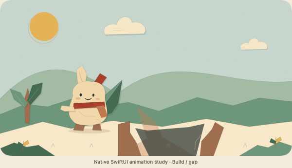

# Crearo

Crearo is an iOS creativity puzzle game. Players invent solutions to unusual situations, receive a visible creativity score out of 100, and advance through levels. The intended experience combines a light, expressive world with satisfying progress and opportunities to compare ideas and scores with friends.

The current app calls its world **Prism**. Its new **Paper Theatre** style uses original SwiftUI artwork: a folded-paper companion, layered landscapes, quiet fiber texture, and small scenes that react to the player's invention. It is an early playable foundation; judge calibration, more authored content, and social features still need development.



This study renders the production drawing code into an animated GIF. It is not a simulator capture. The study loops; an in-game scene finishes after 4.4 seconds, and players can skip to their score at any time.

## Current player experience

1. Complete the opening and name a companion.
2. Read the current level's situation and goal, then type an invention or solution.
3. Receive a score breakdown and practical feedback. Passing ideas get a short Paper Theatre scene; offline grades are labeled practice estimates.
4. Reach the level's required score to advance. Failed answers can be refined and retried.
5. View the accumulated story and personal progress. The current version permits one successful level per day.

There are twelve authored challenges. After those, the challenge bank cycles while the pass mark continues to rise. Progress is saved locally as JSON.

The stage includes ten obstacle archetypes and eight invention silhouettes, with eased action-specific movement, expressive reactions, and static outcomes for Reduce Motion. The interface keeps the current goal, draft, and one primary action clear. Failed attempts keep the draft for revision and do not grant rewards; successful attempts update rewards, world growth, and progression from the same assessment, once per day.

## Development direction and known gaps

The [Paper Theatre design brief](docs/PAPER_THEATRE_DESIGN.md) explains the research, implemented design choices, motion guidance, and a first-session playtest. The earlier [direction brief](docs/CREARO_DIRECTION.md) records the starting implementation audit and proposes twelve new challenges across three regions. That expansion is a proposal, not implemented content.

The next work needs to address these concrete gaps:

- **Scoring and progression:** the current offline challenge path can reach 77/100, below Level 12's required 78. Its vocabulary and length heuristics cannot evaluate whether an answer solves the actual challenge. The earlier 62-point limit in the starting audit applied to the previous cold-start rarity path, which the revised challenge flow no longer uses.
- **World and content:** the paper artwork now distinguishes obstacles and invention categories, but arbitrary inventions still map to a bounded set of silhouettes. The proposed three-region expansion has not been implemented.
- **Social comparison:** there is no leaderboard or shared, server-verified challenge score system yet.

Validation for the Paper Theatre change: all 40 core tests pass, and the real app source compiles and links against the iOS simulator SDK with an iOS 17 deployment target. Native source-rendered artwork and result previews were inspected. An Xcode build, simulator launch, device performance, VoiceOver, keyboard behavior, and large Dynamic Type still require hands-on verification; the previews do not establish those results.

The existing design documents also describe an earlier dark-fantasy survival RPG with hidden creativity scores. Those documents contain useful systems and research, but they do not describe the current app's complete player flow. The direction brief records the current goal of visible scores, level progression, and a light visual identity.

## Run locally

Requirements: Xcode with an iOS SDK, XcodeGen, and a simulator or device supporting iOS 17 or later.

Run the platform-independent game-logic tests:

```bash
cd CrearoCore
swift test
```

From the repository root, create the local configuration and generate the Xcode project:

```bash
cp CrearoApp/Secrets.swift.example CrearoApp/Secrets.swift
xcodegen generate
open Crearo.xcodeproj
```

Leave `anthropicAPIKey` empty to use the offline fallback, subject to the scoring limitation above. To try AI challenge grading and scene direction locally, set your Anthropic key in the gitignored `Secrets.swift`. This direct API configuration is for local testing; a released app needs server-side model credentials and authoritative scoring.

In Xcode, select the `CrearoApp` scheme, choose a simulator or device, and run. For a physical device, configure your signing team and bundle identifier.

## Repository layout

| Path | Purpose |
| --- | --- |
| `CrearoApp/` | SwiftUI app, daily level flow, cut-scenes, local persistence, and AI integration |
| `CrearoCore/` | Foundation-only Swift package for models, scoring, economy, and progression, with unit tests |
| `docs/CREARO_DIRECTION.md` | Current audit, recommended next steps, and proposed world expansion |
| `docs/PAPER_THEATRE_DESIGN.md` | Research, Paper Theatre design decisions, limitations, and playtest protocol |
| `docs/previews/` | Native source-rendered artwork studies, not device screenshots |
| `docs/` | Earlier game design, story, scoring research, architecture, roadmap, and setup guides |
| `supabase/` | Backend schema and Edge Functions for the earlier forge and originality systems |
| `project.yml` | XcodeGen project specification |

Forge, home-base, and other earlier RPG systems remain in the codebase, but the current root view opens the daily level experience. Supabase setup is optional for those earlier systems; the visible challenge judge currently uses the separate local-testing AI path described above.
